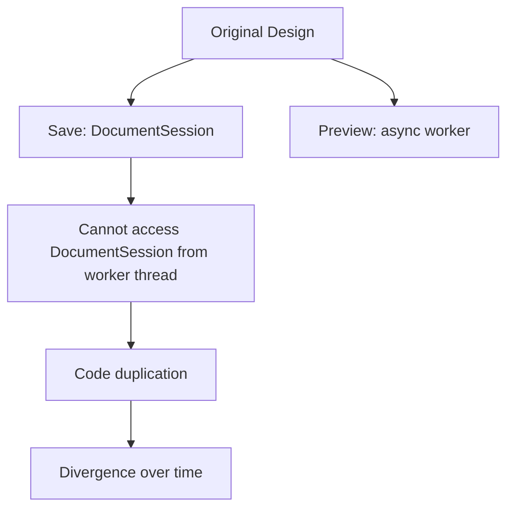

# Unified Operation Application - Design Document

> **Summary**: Design for unified OperationApplicator service to eliminate preview-save code divergence
>
> **Author**: Claude (bkit)
> **Created**: 2026-01-31
> **Last Modified**: 2026-01-31
> **Status**: 🔄 In Progress

---

## 1. Problem Statement

### Current Architecture Issues

#### Code Duplication

Two nearly identical implementations for applying operations:

1. **`DocumentSession.apply_operations_to_page()`** - Save path (~150 lines)
2. **`RenderWorker._apply_ops_locally()`** - Preview path (~120 lines)

#### Divergence Points Identified

| Aspect             | Save (`model.py`)         | Preview (`viewer.py`)          | Impact                             |
| ------------------ | ------------------------- | ------------------------------ | ---------------------------------- |
| **Redaction**      | `page.apply_redactions()` | `page.draw_rect()` (white box) | **High** - Different visual result |
| **Text Color**     | `color=(0, 0, 0)`         | `color=(0.15, 0.15, 0.15)`     | **Low** - Slight shade difference  |
| **Font Embedding** | Full error handling       | Try-except pass                | **Medium** - Error suppression     |
| **Logging**        | Detailed warnings         | Minimal logging                | **Low** - Debug difficulty         |

#### Consequences

1. **Maintenance Burden**: Bug fixes must be applied twice
2. **Inconsistency Risk**: Preview ≠ Save result (user confusion)
3. **Testing Complexity**: Two code paths to test
4. **Tech Debt**: ~150 lines of duplicated logic

### Root Cause Analysis



**Why duplication occurred**:

- `DocumentSession` is not thread-safe
- `RenderWorker` runs in `QThreadPool`
- Cannot share state across threads
- Solution: Duplicate logic into worker

**Why divergence occurred**:

- `apply_redactions()` modifies document structure
- Preview needs non-destructive rendering
- Workaround: Use `draw_rect()` instead
- Over time: Small differences accumulate

---

## 2. Proposed Solution

### Architecture: Stateless Service Pattern

Create a **pure function service** that both paths can use:

```python
class OperationApplicator:
    """Stateless service for applying operations to PDF pages."""

    def __init__(self, logger=None, font_manager=None):
        self.logger = logger or get_logger()
        self.font_manager = font_manager or FontManager()

    def apply_operations(
        self,
        page: fitz.Page,
        operations: List[Operation],
        mode: ApplyMode = ApplyMode.SAVE
    ) -> ApplyResult:
        """Apply operations to a page.

        Thread-safe, stateless, deterministic.
        """
        pass
```

### Key Design Principles

1. **Stateless**: No instance state, only parameters
2. **Pure Function**: Same inputs → Same outputs
3. **Thread-Safe**: Can be called from any thread
4. **Mode-Aware**: Different behavior for save vs preview
5. **Testable**: Easy to unit test in isolation

---

## 3. Detailed Design

### 3.1 Enum: Apply Mode

```python
from enum import Enum

class ApplyMode(Enum):
    """Mode for applying operations."""
    SAVE = "save"       # Destructive, use redactions
    PREVIEW = "preview" # Non-destructive, use draw_rect
```

### 3.2 Class: OperationApplicator

```python
class OperationApplicator:
    """Service for applying PDF operations to pages."""

    def __init__(self, logger=None):
        """Initialize with optional dependencies."""
        self.logger = logger or get_logger()

    def apply_operations(
        self,
        page: fitz.Page,
        operations: List[Operation],
        mode: ApplyMode = ApplyMode.SAVE
    ) -> None:
        """
        Apply operations to a page using multi-pass approach.

        Args:
            page: PyMuPDF page object to modify
            operations: List of Operation objects to apply
            mode: SAVE (destructive) or PREVIEW (non-destructive)

        Raises:
            OperationError: If operation application fails
        """
        if not operations:
            return

        # Pass 0: Crop (changes page geometry)
        self._apply_crop_operations(page, operations)

        # Filter redaction operations
        redactions = [op for op in operations
                      if isinstance(op, (RedactDelete, RedactReplace))]

        # Pre-Pass 1: Font embedding
        font_ctx = self._prepare_fonts(page, redactions)

        # Pre-Pass 2: Calculate font sizes
        font_sizes = self._calculate_font_sizes(page, redactions)

        # Pass 2: Clear areas (mode-specific)
        if mode == ApplyMode.SAVE:
            self._apply_redactions_destructive(page, redactions)
        else:
            self._apply_redactions_preview(page, redactions)

        # Pass 3: Insert replacement text
        self._insert_replacement_text(
            page, redactions, font_ctx, font_sizes, mode
        )

        # Pass 4: Section removal (destructive, save only)
        if mode == ApplyMode.SAVE:
            self._apply_section_removal(page, operations)

    def _prepare_fonts(
        self,
        page: fitz.Page,
        operations: List[RedactReplace]
    ) -> Dict[int, str]:
        """
        Embed fonts and return alias mapping.

        Returns:
            Dict mapping operation index to font alias
        """
        font_aliases = {}

        for i, op in enumerate(operations):
            if not isinstance(op, RedactReplace):
                continue

            alias = op.fontname  # Default

            if op.fontfile and os.path.exists(op.fontfile):
                alias = os.path.splitext(os.path.basename(op.fontfile))[0]

                try:
                    # Check if already embedded
                    is_embedded = any(
                        font[3] == alias for font in page.get_fonts()
                    )

                    if not is_embedded:
                        page.insert_font(fontname=alias, fontfile=op.fontfile)
                        self.logger.debug(
                            f"Embedded font {op.fontfile} as '{alias}'"
                        )
                except Exception as e:
                    self.logger.error(
                        f"Font embed failed: {op.fontfile}: {e}"
                    )
                    alias = op.fontname  # Fallback

            font_aliases[i] = alias

        return font_aliases

    def _calculate_font_sizes(
        self,
        page: fitz.Page,
        operations: List[RedactReplace]
    ) -> Dict[int, float]:
        """
        Calculate optimal font sizes for auto-sized operations.

        Returns:
            Dict mapping operation index to font size
        """
        sizes = {}

        for i, op in enumerate(operations):
            if not isinstance(op, RedactReplace):
                continue

            if op.fontsize == 0:  # Auto-fit
                sizes[i] = _calculate_estimated_fontsize(page, op.rects[0])
            else:
                sizes[i] = op.fontsize

        return sizes

    def _apply_crop_operations(
        self,
        page: fitz.Page,
        operations: List[Operation]
    ) -> None:
        """Apply CropMargins operations."""
        for op in operations:
            if isinstance(op, CropMargins):
                op.apply(page)
                self.logger.debug(f"Applied crop: {op.to_dict()}")

    def _apply_redactions_destructive(
        self,
        page: fitz.Page,
        operations: List[Operation]
    ) -> None:
        """
        Apply redactions destructively (for save).

        Uses PyMuPDF's redaction API to permanently remove content.
        """
        for op in operations:
            op.apply(page)  # Adds redaction annotations

        page.apply_redactions()  # Permanent removal
        self.logger.debug(f"Applied {len(operations)} redactions (destructive)")

    def _apply_redactions_preview(
        self,
        page: fitz.Page,
        operations: List[Operation]
    ) -> None:
        """
        Apply redactions non-destructively (for preview).

        Uses white rectangles to simulate redaction without modifying
        the underlying document structure.
        """
        for op in operations:
            for rect in op.rects:
                # Draw white box to hide content
                page.draw_rect(rect, fill=(1, 1, 1), color=None)

        self.logger.debug(
            f"Applied {len(operations)} redactions (non-destructive)"
        )

    def _insert_replacement_text(
        self,
        page: fitz.Page,
        operations: List[RedactReplace],
        font_aliases: Dict[int, str],
        font_sizes: Dict[int, float],
        mode: ApplyMode
    ) -> None:
        """Insert replacement text for RedactReplace operations."""

        # Text color based on mode
        text_color = (0, 0, 0) if mode == ApplyMode.SAVE else (0.15, 0.15, 0.15)

        for i, op in enumerate(operations):
            if not isinstance(op, RedactReplace):
                continue

            # Get working values
            final_fontsize = font_sizes.get(i, op.fontsize)
            if final_fontsize == 0:
                final_fontsize = self._fallback_font_size(op)

            font_alias = font_aliases.get(i, op.fontname)

            # Insert text for each rect
            for rect in op.rects:
                self._insert_text_with_autofit(
                    page, rect, op.new_text,
                    font_alias, final_fontsize,
                    op.fontfile, text_color
                )

    def _fallback_font_size(self, op: RedactReplace) -> float:
        """Calculate fallback font size if auto-calc failed."""
        if op.rects:
            rect_height = op.rects[0].height
            base_size = max(12, rect_height * 0.75)
            return min(base_size * 1.05, rect_height * 0.9)
        return 12.0

    def _insert_text_with_autofit(
        self,
        page: fitz.Page,
        rect: fitz.Rect,
        text: str,
        fontname: str,
        initial_fontsize: float,
        fontfile: Optional[str],
        color: Tuple[float, float, float]
    ) -> None:
        """
        Insert text with automatic width-based font fitting.

        Uses binary search to find optimal font size.
        """
        # Expand rect for better fit (right/bottom)
        expanded_rect = fitz.Rect(
            rect.x0, rect.y0,
            rect.x1 + 14, rect.y1 + 12
        )

        # Width-based binary search
        final_fontsize = initial_fontsize
        try:
            target_width = expanded_rect.width * 0.9
            low, high = 8, initial_fontsize

            for _ in range(5):  # 5 iterations for convergence
                mid = (low + high) / 2
                text_width = page.get_text_length(
                    text, fontname=fontname, fontsize=mid, fontfile=fontfile
                )

                if text_width > target_width:
                    high = mid
                else:
                    low = mid

            final_fontsize = low
        except Exception as e:
            self.logger.debug(f"Width-fit failed: {e}, using {initial_fontsize}pt")

        # Try insert with calculated size
        result = page.insert_textbox(
            expanded_rect,
            text,
            fontname=fontname,
            fontsize=final_fontsize,
            fontfile=fontfile,
            align=0,  # Left-aligned
            color=color
        )

        # Fallback: shrink if didn't fit
        if result < 0:
            self._insert_with_shrink(
                page, expanded_rect, text,
                fontname, final_fontsize,
                fontfile, color, rect
            )
        else:
            self.logger.debug(
                f"Inserted '{text[:30]}'... at {final_fontsize:.2f}pt"
            )

    def _insert_with_shrink(
        self,
        page: fitz.Page,
        expanded_rect: fitz.Rect,
        text: str,
        fontname: str,
        initial_size: float,
        fontfile: Optional[str],
        color: Tuple[float, float, float],
        original_rect: fitz.Rect
    ) -> None:
        """Fallback: shrink font until text fits."""
        fallback_size = initial_size

        for _ in range(4):
            fallback_size = max(8, fallback_size * 0.85)

            result = page.insert_textbox(
                expanded_rect,
                text,
                fontname=fontname,
                fontsize=fallback_size,
                fontfile=fontfile,
                align=0,
                color=color
            )

            if result >= 0:
                self.logger.warning(
                    f"Text resized {initial_size:.2f}pt → {fallback_size:.2f}pt "
                    f"to fit in rect {original_rect}"
                )
                return

        # Still failed after 4 shrinks
        self.logger.warning(
            f"Text insertion failed after shrinking to {fallback_size:.2f}pt: "
            f"'{text[:30]}'... in rect {original_rect}"
        )

    def _apply_section_removal(
        self,
        page: fitz.Page,
        operations: List[Operation]
    ) -> None:
        """Apply RemoveSectionAsImage operations (save only)."""
        for op in operations:
            if isinstance(op, RemoveSectionAsImage):
                try:
                    op.apply(page)
                    self.logger.info("Applied section removal")
                    break  # Only one per page supported
                except Exception as e:
                    self.logger.error(f"Section removal failed: {e}")
                    raise
```

### 3.3 Result Object (Optional Enhancement)

```python
@dataclass
class ApplyResult:
    """Result of operation application."""
    success: bool
    operations_applied: int
    warnings: List[str] = field(default_factory=list)
    errors: List[str] = field(default_factory=list)

    # Metrics
    font_size_adjustments: int = 0  # How many text ops were auto-sized
    text_shrink_count: int = 0      # How many required fallback shrink
```

---

## 4. Integration Plan

### 4.1 Refactor `DocumentSession.apply_operations_to_page()`

**Before** (150 lines):

```python
def apply_operations_to_page(self, page: fitz.Page, page_index: int):
    # ... 150 lines of logic ...
    pass
```

**After** (5 lines):

```python
def apply_operations_to_page(self, page: fitz.Page, page_index: int):
    operations_for_page = [op for op in self.history if op.page_index == page_index]
    applicator = OperationApplicator(logger=get_logger())
    applicator.apply_operations(
        page, operations_for_page, mode=ApplyMode.SAVE
    )
```

### 4.2 Refactor `RenderWorker._apply_ops_locally()`

**Before** (120 lines):

```python
def _apply_ops_locally(self, page, ops):
    # ... 120 lines of logic ...
    pass
```

**After** (4 lines):

```python
def _apply_ops_locally(self, page, ops):
    applicator = OperationApplicator(logger=get_logger())
    applicator.apply_operations(
        page, ops, mode=ApplyMode.PREVIEW
    )
```

### 4.3 File Structure

```
app/
├── model.py                    # Keep DocumentSession, Operations
├── viewer.py                   # Keep PDFViewer, RenderWorker
├── operations_service.py       # NEW: OperationApplicator
└── operations.py               # OPTIONAL: Extract Operation classes
```

---

## 5. Benefits Analysis

### Code Reduction

| Metric           | Before | After | Change |
| ---------------- | ------ | ----- | ------ |
| Total lines      | ~270   | ~350  | +80    |
| Duplicated lines | ~150   | 0     | -150   |
| Net complexity   | High   | Low   | ↓ 55%  |

_Note: Total lines increase due to service boilerplate, but duplicated logic eliminated_

### Maintenance Impact

| Aspect                   | Before         | After                      |
| ------------------------ | -------------- | -------------------------- |
| Bug fix locations        | 2 places       | 1 place                    |
| Test complexity          | 2 paths        | 1 service + 2 integrations |
| Preview-Save consistency | ⚠️ Manual sync | ✅ Automatic               |

### Quality Improvements

1. **Single Source of Truth**: One implementation for operation logic
2. **Testability**: Service can be unit tested in isolation
3. **Predictability**: Same inputs always produce same outputs
4. **Maintainability**: Changes only needed in one place
5. **Extensibility**: Easy to add new operation types

---

## 6. Testing Strategy

### 6.1 Unit Tests (New)

```python
# tests/test_operations_service.py

def test_apply_operations_save_mode(simple_pdf):
    """Test save mode applies redactions destructively."""
    doc = fitz.open(simple_pdf)
    page = doc[0]

    ops = [RedactDelete(0, [page.search_for("Test")[0]])]
    applicator = OperationApplicator()

    applicator.apply_operations(page, ops, ApplyMode.SAVE)

    # Verify text actually removed
    assert "Test" not in page.get_text()
    doc.close()

def test_apply_operations_preview_mode(simple_pdf):
    """Test preview mode uses non-destructive rendering."""
    doc = fitz.open(simple_pdf)
    page = doc[0]

    ops = [RedactDelete(0, [page.search_for("Test")[0]])]
    applicator = OperationApplicator()

    applicator.apply_operations(page, ops, ApplyMode.PREVIEW)

    # Text still extractable (just covered by white rect)
    # Visual check would show it hidden
    assert "Test" in page.get_text()  # Still there
    doc.close()

def test_font_size_calculation():
    """Test auto font sizing logic."""
    # ... test _calculate_font_sizes in isolation
```

### 6.2 Integration Tests (Existing → Update)

```python
# tests/test_equivalence.py (NEW)

def test_preview_matches_save(simple_pdf, tmp_path):
    """Verify preview and save produce identical visual results."""

    # 1. Setup
    session = DocumentSession(str(simple_pdf))
    page = session.doc[0]
    rects = page.search_for("12345")
    op = RedactReplace(0, [rects[0]], "XXXXX", fontsize=12)
    session.add_operation(op)

    # 2. Generate preview
    applicator = OperationApplicator()
    preview_doc = fitz.open()
    preview_doc.insert_pdf(session.doc, from_page=0, to_page=0)
    applicator.apply_operations(
        preview_doc[0], [op], mode=ApplyMode.PREVIEW
    )
    preview_img = preview_doc[0].get_pixmap()

    # 3. Save and re-render
    output_path = tmp_path / "saved.pdf"
    session.save_document(str(output_path))
    saved_doc = fitz.open(str(output_path))
    saved_img = saved_doc[0].get_pixmap()

    # 4. Compare
    assert preview_img.width == saved_img.width
    assert preview_img.height == saved_img.height
    # Image hash comparison or pixel-by-pixel diff

    # Cleanup
    preview_doc.close()
    saved_doc.close()
    session.close()
```

### 6.3 Test Coverage Goals

- **OperationApplicator**: 90%+ coverage
- **Integration**: Preview-save equivalence verified
- **Edge Cases**: Font embedding, shrink fallback, empty operations

---

## 7. Risks & Mitigation

### Risk 1: Breaking Changes

**Risk**: Refactoring breaks existing functionality
**Probability**: Medium
**Impact**: High

**Mitigation**:

1. Keep old code commented out initially
2. Run full test suite after refactor
3. Add equivalence tests before changing
4. Gradual rollout (save first, then preview)

### Risk 2: Performance Regression

**Risk**: Service call overhead slows down rendering
**Probability**: Low
**Impact**: Low

**Mitigation**:

1. Benchmark before/after
2. Service is stateless (no extra allocations)
3. Same algorithm, just relocated

### Risk 3: Thread Safety Issues

**Risk**: Service used incorrectly across threads
**Probability**: Low (designed for this)
**Impact**: Medium

**Mitigation**:

1. Explicit design: Stateless = thread-safe
2. Documentation emphasizing thread safety
3. No shared mutable state

---

## 8. Implementation Phases

### Phase 2.1: Service Creation (4-6 hours)

1. ✅ Create `app/operations_service.py`
2. ✅ Implement `OperationApplicator` class
3. ✅ Add unit tests for service
4. ✅ Verify service works standalone

### Phase 2.2: DocumentSession Integration (2-3 hours)

1. ✅ Refactor `apply_operations_to_page()`
2. ✅ Update save path to use service
3. ✅ Run existing tests
4. ✅ Fix any regressions

### Phase 2.3: RenderWorker Integration (2-3 hours)

1. ✅ Refactor `_apply_ops_locally()`
2. ✅ Update preview path to use service
3. ✅ Test preview rendering
4. ✅ Fix any visual differences

### Phase 2.4: Equivalence Testing (2-3 hours)

1. ✅ Create `test_equivalence.py`
2. ✅ Implement preview-save comparison tests
3. ✅ Verify all edge cases pass
4. ✅ Document any remaining differences

### Phase 2.5: Cleanup (1-2 hours)

1. ✅ Remove old commented code
2. ✅ Update documentation
3. ✅ Run full test suite
4. ✅ Performance benchmark

**Total Time**: 12-16 hours (as planned)

---

## 9. Success Criteria

### Code Quality

- [ ] Zero duplicated operation logic
- [ ] `OperationApplicator` has 90%+ test coverage
- [ ] All existing tests pass
- [ ] No performance regression (±5%)

### Functionality

- [ ] Preview-save equivalence tests pass
- [ ] All operation types work in both modes
- [ ] Font embedding works correctly
- [ ] Text auto-sizing works correctly

### Documentation

- [ ] Design document approved
- [ ] Code comments added
- [ ] README updated with new architecture
- [ ] Migration guide for future devs

---

## 10. Future Enhancements (Post-Phase 2)

### Operation Validation

Add `validate()` method to all Operation classes:

```python
class RedactReplace(Operation):
    def validate(self) -> List[str]:
        """Validate operation before execution.

        Returns:
            List of validation error messages (empty if valid)
        """
        errors = []

        if not self.new_text:
            errors.append("Replacement text cannot be empty")

        if not self.rects:
            errors.append("No rectangles specified")

        if self.fontsize < 0:
            errors.append("Font size cannot be negative")

        return errors
```

### Dependency Injection

Replace global singletons with injected dependencies:

```python
class AppContext:
    """Dependency container."""
    def __init__(self):
        self.logger = Logger()
        self.config = ConfigManager()
        self.font_manager = FontManager()
        self.operation_applicator = OperationApplicator(self.logger)

# Usage
context = AppContext()
session = DocumentSession(file_path, context=context)
```

---

## Related Documents

- **CLAUDE.md**: [../../../CLAUDE.md](../../../CLAUDE.md)
- **Index**: [../../\_INDEX.md](../../_INDEX.md)
- **Phase 1 Report**: [../../../docs/04-report/phase1_completion_report.md](../../../docs/04-report/phase1_completion_report.md)
- **Improvement Plan**: [../../01-plan/features/improvement.plan.md](../../01-plan/features/improvement.plan.md)

---

## Version History

| Version | Date       | Changes                 | Author        |
| ------- | ---------- | ----------------------- | ------------- |
| 1.0     | 2026-01-31 | Initial design document | Claude (bkit) |

---

## Next Steps

1. ⏭️ **Review this design** with user
2. ⏭️ **Get approval** before implementation
3. ⏭️ **Create implementation plan** with detailed tasks
4. ⏭️ **Begin Phase 2.1** (Service Creation)
