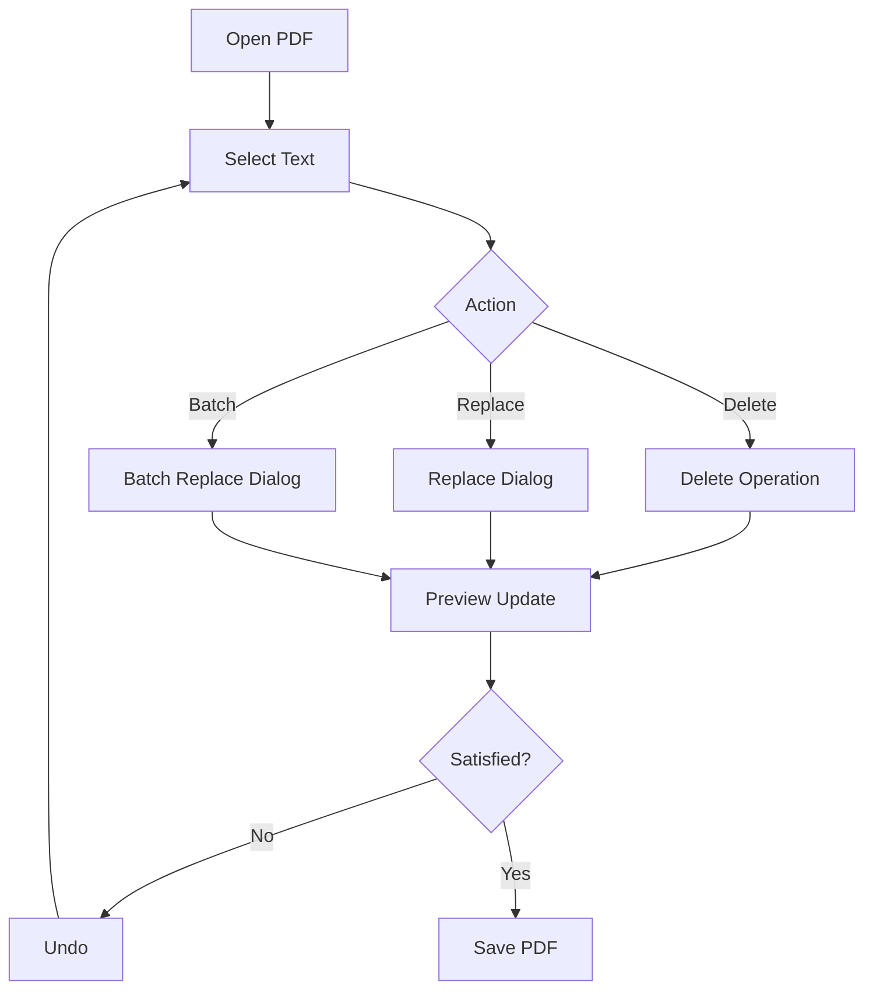

# Current State Analysis - PDF Control Project

> **Summary**: Comprehensive analysis of PDF Control project's current state, identifying strengths, weaknesses, and improvement areas
>
> **Author**: Claude (bkit)
> **Created**: 2026-01-30
> **Last Modified**: 2026-01-30
> **Status**: 🔄 In Progress

---

## 1. Executive Summary

### Project Overview

PDF Control is a **Starter-level** desktop application built with PySide6 and PyMuPDF for PDF text manipulation. The project has achieved **functional completeness** for core features but requires **quality improvements** and **code refactoring** to reach production-ready status.

### Key Findings

#### ✅ Strengths

1. **Feature Completeness**: All core features implemented and working
2. **Good Architecture**: Clean separation (UI, Model, Controller, Viewer)
3. **i18n Support**: Multi-language infrastructure in place
4. **Testing Foundation**: pytest + pytest-qt setup with basic coverage
5. **Documentation**: Existing status and improvement documents

#### ⚠️ Weaknesses

1. **Documentation Drift**: This analysis still contains older risk statements that have since been resolved in code
2. **Type Coverage Gap**: Strict mypy enforcement is scoped to `app/operations_service.py`, not the full `app/` package
3. **Large UI Surface**: `app/ui.py` remains the largest module and is harder to review and test in isolation
4. **Repository Hygiene**: The working folder is not a Git repository, so history-based review and diff workflows are limited
5. **Packaging/Release Risk**: Frozen build artifacts exist, but release gates still need regular verification

#### 🚨 Critical Issues

1. **UI Section Removal Bug**: `RemoveSectionAsImage` was called with `image_format` instead of `format` from the UI path
2. **Direct i18n Script Execution**: Console output used non-ASCII markers that can fail on Windows CP949 consoles
3. **Docs vs Code Mismatch**: Some completed fixes were still described here as active critical risks

---

## 2. Architecture Analysis

### Current Architecture

```
┌─────────────────────────────────────────────────────┐
│                    main.py                          │
│              (Application Entry)                     │
└────────────────────┬────────────────────────────────┘
                     │
        ┌────────────▼────────────┐
        │      MainWindow         │
        │       (ui.py)           │
        │  ┌──────────────────┐   │
        │  │   PDFViewer      │   │
        │  │   (viewer.py)    │   │
        │  └──────────────────┘   │
        └────────┬────────────────┘
                 │
    ┌────────────▼──────────┐
    │   DocumentSession     │
    │     (model.py)        │
    │  - Operations         │
    │  - History            │
    │  - State              │
    └────────┬──────────────┘
             │
    ┌────────▼──────────┐
    │    Utilities       │
    │  - config.py       │
    │  - fonts.py        │
    │  - logger.py       │
    │  - i18n.py         │
    └────────────────────┘
```

### Design Patterns Used

- **MVC Pattern**: Model (DocumentSession), View (UI/Viewer), Controller (Controller)
- **Command Pattern**: Operations (DeleteTextOp, ReplaceTextOp, etc.)
- **Observer Pattern**: Qt signals/slots for UI updates
- **Worker Pattern**: RenderWorker for async preview

### Architectural Strengths

✅ Clear separation of concerns
✅ Testable components (Model independent of UI)
✅ Extensible operation system

### Architectural Weaknesses

⚠️ **Duplication**: Preview (RenderWorker) and Save (DocumentSession) use different code paths
⚠️ **Global State**: Logger, Config as singletons (hard to test in isolation)
⚠️ **Tight Coupling**: Font management coupled to Windows registry

---

## 3. Code Quality Analysis

### Code Metrics

| Metric               | Value                  | Status             |
| -------------------- | ---------------------- | ------------------ |
| Total Python Files   | ~14                    | ✅ Manageable      |
| Largest File         | `ui.py` (39,575 bytes) | ⚠️ Needs splitting |
| Test Coverage        | ~30% (estimated)       | ⚠️ Insufficient    |
| i18n Coverage        | 100% for en/ko         | ✅ Complete        |
| Known Technical Debt | 7 items                | ⚠️ Tracked         |

### Code Quality Issues

#### 1. DRY Violations

**Issue**: Text operation logic duplicated between preview and save

- **Location**: `model.py::DocumentSession.apply_operations_to_page()` vs `viewer.py::RenderWorker.run()`
- **Impact**: Bug fixes need to be applied twice, divergence risk
- **Recommendation**: Extract to shared `OperationApplicator` service

#### 2. Long Functions

**Issue**: `ui.py::MainWindow` has methods exceeding 50 lines

- **Example**: `initUI()` likely >100 lines
- **Impact**: Hard to test, hard to maintain
- **Recommendation**: Split into smaller methods or separate UI modules

#### 3. Hardcoded Values

**Issue**: Font size limits (8pt min, 14/12pt default) hardcoded

- **Location**: Multiple files
- **Impact**: Inflexible, hard to customize
- **Recommendation**: Move to `config.json` or `DEFAULT_CONFIG`

#### 4. Error Handling Gaps

**Issue**: Missing user feedback for edge cases

- **Example**: Text scaling failure only logs warning, no UI notification
- **Impact**: User confusion ("where did my text go?")
- **Recommendation**: Add status bar messages, dialog warnings

---

## 4. Testing Analysis

### Current Test Coverage

```
tests/
├── test_ui.py              # UI integration tests
├── test_model.py           # Document session tests
└── test_operations.py      # Operation logic tests
```

### Existing Tests

✅ Smoke tests (basic open/save)
✅ Undo/redo functionality
✅ Remove section operations
✅ Async rendering

### Missing Tests (Critical)

❌ **Preview-Save Equivalence**: No test verifying preview matches saved output
❌ **Long Text Edge Cases**: No test for text scaling failure scenarios
❌ **i18n Validation**: No automated check for missing keys/placeholders
❌ **Memory Limits**: No test for large section removal memory guard
❌ **Config Management**: No test for default config pollution

### Test Quality Issues

⚠️ **External Dependencies**: Some tests depend on `sample.pdf` file (fragile)
⚠️ **Async Handling**: Potential race conditions in async render tests
⚠️ **Fixture Management**: No centralized PDF fixture creation

---

## 5. Feature Analysis

### Core Features Status

| Feature             | Status      | Quality  | Issues             |
| ------------------- | ----------- | -------- | ------------------ |
| PDF Open/Save       | ✅ Complete | ⭐⭐⭐⭐ | -                  |
| Text Selection      | ✅ Complete | ⭐⭐⭐⭐ | -                  |
| Text Deletion       | ✅ Complete | ⭐⭐⭐⭐ | -                  |
| Text Replacement    | ✅ Complete | ⭐⭐⭐   | Long text fails    |
| Batch Find/Replace  | ✅ Complete | ⭐⭐⭐⭐ | -                  |
| Undo/Redo           | ✅ Complete | ⭐⭐⭐⭐ | -                  |
| History Panel       | ✅ Complete | ⭐⭐⭐   | Limited metadata   |
| Crop/Remove Section | ✅ Complete | ⭐⭐⭐   | Memory risk        |
| Font Management     | ✅ Complete | ⭐⭐⭐   | Windows-only       |
| i18n (en/ko)        | ✅ Complete | ⭐⭐⭐⭐ | -                  |
| Viewer Zoom/Pan     | ✅ Complete | ⭐⭐⭐⭐ | -                  |
| Logging             | ✅ Complete | ⭐⭐⭐   | Log path not shown |

### Feature Deep Dive: Text Replacement

**Current Implementation**:

1. User selects text rectangle
2. Enters replacement text
3. System calculates font size to fit (14pt → 12pt → 8pt binary search)
4. Left-aligned, expands right/bottom
5. Preview shows result

**Issues**:

- ❌ Very long text in narrow areas fails even at 8pt
- ❌ No option to use fixed font size
- ❌ No visual warning when scaling occurs
- ❌ Preview and save use different calculation logic

**User Impact**:

- Frustration when text disappears
- Confusion about why preview differs from save
- No workaround for extreme cases

**Recommended Improvements** (from `IMPROVEMENT_PLAN.md`):

1. Add "Fixed Font Size" option (8-10pt range)
2. Show status bar warning when scaling/failure occurs
3. Display scaling metadata in history panel
4. Unify preview-save logic completely

---

## 6. UX Analysis

### User Workflow



### UX Strengths

✅ Clear workflow (select → action → preview → save)
✅ Undo/redo for mistake recovery
✅ Multi-language support
✅ History panel for tracking changes

### UX Weaknesses

❌ **No Feedback for Edge Cases**: When text scaling fails, no visual warning
❌ **Limited History Metadata**: Doesn't show scaling info, font size used
❌ **Crop/Remove Dialogs**: No preview of expected result (height, file size)
❌ **Selection Feedback**: No visual indicator for empty selection on action
❌ **Status Bar Underutilized**: Could show more real-time info

---

## 7. i18n Analysis

### Current Status

✅ Infrastructure complete (`i18n.py`, `en.json`, `ko.json`)
✅ All UI strings use i18n keys
✅ Runtime language switching possible

### i18n Files

**English (`en.json`)**:

- Status: ✅ Complete
- Keys: ~50-70 (estimated)

**Korean (`ko.json`)**:

- Status: ✅ Complete
- Keys: ~50-70 (estimated)

### Issues

❌ **No Validation**: Missing script to check key completeness
❌ **No Placeholder Check**: No verification that `{0}`, `{1}` match across languages
❌ **No Runtime Fallback**: Missing keys might crash instead of showing English
❌ **No CI Integration**: Translation checks not automated

### Recommendations

1. Create `scripts/validate_i18n.py` to check:
   - All keys exist in all language files
   - Placeholder counts match
   - No duplicate keys
2. Add to pytest or pre-commit hook
3. Implement runtime fallback to English for missing keys

---

## 8. Configuration Management Analysis

### Current System

**File**: `config.json`

```json
{
  "default_zoom": 1.0,
  "auto_save": false,
  ...
}
```

**Code**: `app/config.py`

- Loads from `config.json`
- Provides `DEFAULT_CONFIG` dict
- Saves user changes

### Issues

#### 1. Default Config Pollution

**Issue**: `DEFAULT_CONFIG` is mutable dict, can be modified during runtime

```python
DEFAULT_CONFIG = {
    "default_zoom": 1.0
}

# Somewhere in code:
config = DEFAULT_CONFIG  # Reference, not copy!
config["default_zoom"] = 2.0  # Pollutes DEFAULT_CONFIG!
```

**Impact**: Tests and subsequent sessions use polluted defaults

**Fix**: Deep copy when accessing

```python
import copy

def get_default_config():
    return copy.deepcopy(DEFAULT_CONFIG)
```

#### 2. No Validation

**Issue**: No schema validation for loaded config
**Impact**: Corrupted `config.json` can crash app
**Fix**: Add schema validation (JSON Schema or manual checks)

#### 3. No Migration

**Issue**: Old `config.json` format will break on new releases
**Impact**: User frustration, manual deletion needed
**Fix**: Add version field and migration logic

---

## 9. Resource Management Analysis

### Memory Management

#### Issue: Preview Temp Documents Not Closed

**Code**: `viewer.py::RenderWorker.run()`

```python
temp_doc = fitz.open(temp_path)
# ... render ...
# MISSING: temp_doc.close()
```

**Impact**: File handle leak, memory leak over time
**Fix**: Add proper cleanup in `finally` block

#### Issue: Large Section Removal Memory Spike

**Code**: `model.py::RemoveSectionOp`

- Converts section to high-DPI image
- No memory limit check before conversion
- Can consume GB of memory for large pages

**Impact**: App freeze, crash, or system slowdown
**Fix**: Add memory estimation before conversion, cap DPI, warn user

### File I/O

✅ **Good**: Uses `with` statements for file operations
✅ **Good**: Temp files cleaned up in most cases
⚠️ **Warning**: No atomic save (writes directly to target)

**Recommendation**: Use temp file + atomic rename pattern

```python
with tempfile.NamedTemporaryFile(delete=False) as tmp:
    doc.save(tmp.name)
os.replace(tmp.name, target_path)  # Atomic on same filesystem
```

---

## 10. Packaging Analysis

### Current Status

❌ **Not Packaged**: No PyInstaller spec or exe builds yet
❌ **Not Tested**: Frozen vs unfrozen paths not verified

### Identified Risks (from `IMPROVEMENT_PLAN.md`)

1. **Relative Paths**: Code assumes working directory = project root
   - `app/i18n/en.json` won't work in frozen exe
   - **Fix**: Path helpers for frozen detection

2. **Data Bundling**: i18n files not included in spec
   - **Fix**: Add to `datas` list in `.spec` file

3. **Hidden Imports**: PyMuPDF, PySide6 plugins may need explicit listing
   - **Fix**: Test and add to `hiddenimports`

4. **UTF-8 Encoding**: Windows default encoding issues
   - **Fix**: Set `PYTHONUTF8=1` environment variable

### Recommended Packaging Structure

```python
# helpers.py
import sys
import os

def get_app_dir():
    if getattr(sys, 'frozen', False):
        return sys._MEIPASS
    return os.path.dirname(__file__)

def get_data_path(relative_path):
    return os.path.join(get_app_dir(), relative_path)
```

---

## 11. Technical Debt Summary

### From `IMPROVEMENT_PLAN.md`

| Priority  | Item                             | Effort | Impact |
| --------- | -------------------------------- | ------ | ------ |
| 🔴 High   | Config default pollution fix     | Low    | Medium |
| 🔴 High   | Preview temp doc cleanup         | Low    | Medium |
| 🔴 High   | Preview-save logic unification   | High   | High   |
| 🟡 Medium | Fixed font size option           | Medium | High   |
| 🟡 Medium | i18n validation script           | Low    | Medium |
| 🟡 Medium | Memory guard for section removal | Medium | High   |
| 🟢 Low    | PyInstaller packaging            | High   | Low    |
| 🟢 Low    | History panel metadata           | Low    | Low    |

### Estimated Effort

- **Immediate Fixes (Hotfix)**: 2-4 hours
  - Config deepcopy
  - Temp doc close
  - Test fixture fixes

- **Core Refactor**: 8-12 hours
  - Unify preview-save logic
  - Extract operation applicator service
  - Add validation layer

- **UX Enhancement**: 4-6 hours
  - Fixed font size option
  - Status bar messages
  - History metadata

- **Testing & i18n**: 4-6 hours
  - i18n validation script
  - Preview-save equivalence tests
  - Edge case tests

- **Packaging**: 4-8 hours
  - PyInstaller spec creation
  - Path helper implementation
  - Build testing

**Total**: 22-36 hours (3-5 days of focused work)

---

## 12. Recommendations

### Immediate Actions (Next 1-2 Days)

1. **Fix Critical Bugs** ✅
   - Apply config deepcopy fix
   - Add temp doc cleanup
   - Fix test fixtures

2. **Create PDCA Structure** ✅
   - Initialize `docs/` with PDCA folders
   - Create `CLAUDE.md`
   - Create `_INDEX.md`

3. **Document Current State** 🔄 (This document)
   - Analysis complete
   - Ready for planning phase

### Short-term Goals (Next 1-2 Weeks)

4. **Core Refactoring**
   - Plan and design unified operation applicator
   - Extract logic from DocumentSession and RenderWorker
   - Implement and test

5. **UX Improvements**
   - Design fixed font size option
   - Implement status bar warnings
   - Enhance history panel

6. **Testing**
   - Create i18n validation script
   - Add preview-save equivalence tests
   - Add edge case tests

### Long-term Goals (Next 1-3 Months)

7. **Packaging**
   - Create PyInstaller spec
   - Test frozen builds
   - Create distribution package

8. **Feature Enhancements** (from `NEXT_STEPS.md`)
   - Span/line overlay selection UI
   - Replacement templates/favorites
   - Operation summary export

9. **Platform Expansion**
   - Test on macOS (if desired)
   - Test on Linux (if desired)
   - Abstract font management for cross-platform

---

## 13. Gap Analysis vs Best Practices

### Code Quality

| Best Practice  | Current    | Gap                              | Priority |
| -------------- | ---------- | -------------------------------- | -------- |
| DRY principle  | ⚠️ Partial | Preview-save duplication         | High     |
| SRP            | ✅ Good    | -                                | -        |
| No hardcoding  | ⚠️ Partial | Font sizes hardcoded             | Medium   |
| Error handling | ⚠️ Partial | Silent failures for text scaling | High     |
| Logging        | ✅ Good    | -                                | -        |
| Documentation  | ✅ Good    | -                                | -        |

### Testing

| Best Practice     | Current    | Gap                      | Priority |
| ----------------- | ---------- | ------------------------ | -------- |
| Unit tests        | ⚠️ Partial | ~30% coverage            | Medium   |
| Integration tests | ✅ Good    | -                        | -        |
| Edge case tests   | ❌ Missing | Long text, narrow areas  | High     |
| Regression tests  | ❌ Missing | Preview-save equivalence | High     |
| CI/CD             | ❌ Missing | No automated testing     | Low      |

### Architecture

| Best Practice          | Current    | Gap                           | Priority |
| ---------------------- | ---------- | ----------------------------- | -------- |
| Separation of concerns | ✅ Good    | -                             | -        |
| Dependency injection   | ⚠️ Partial | Singletons hard to test       | Medium   |
| Interface segregation  | ✅ Good    | -                             | -        |
| Open-closed principle  | ⚠️ Partial | Operations extensible, but... | Low      |

---

## 14. Risk Assessment

### High Risk

🔴 **Text Replacement Failure in Edge Cases**

- **Probability**: Medium (10-20% of users will encounter)
- **Impact**: High (data loss perception, user frustration)
- **Mitigation**: Add fixed font size option, clear warnings

🔴 **Memory Crash on Large Section Removal**

- **Probability**: Low (rare use case)
- **Impact**: High (app crash, work loss)
- **Mitigation**: Add memory estimation, DPI cap, warnings

### Medium Risk

🟡 **Preview-Save Mismatch**

- **Probability**: Medium (due to code divergence)
- **Impact**: Medium (user confusion, trust issues)
- **Mitigation**: Unify logic immediately

🟡 **Packaging Failures**

- **Probability**: High (not tested yet)
- **Impact**: Medium (delays release)
- **Mitigation**: Early testing, path helpers

### Low Risk

🟢 **i18n Key Mismatches**

- **Probability**: Low (only 2 languages, well-tested)
- **Impact**: Low (UI glitches only)
- **Mitigation**: Validation script

---

## 15. Success Criteria

For this project to be considered "production-ready":

### Stability

- [ ] No critical bugs (crashes, data loss)
- [ ] All edge cases handled gracefully with user feedback
- [ ] Memory usage within reasonable bounds (<500MB for typical use)
- [ ] No resource leaks (file handles, memory)

### Quality

- [ ] Test coverage >70%
- [ ] All preview-save equivalence tests pass
- [ ] i18n validation passes
- [ ] Code review passes (DRY, SRP checks)

### UX

- [ ] All operations provide clear feedback
- [ ] Edge cases show warnings before failure
- [ ] History panel shows complete metadata
- [ ] Status bar actively informs user

### Packaging

- [ ] PyInstaller build succeeds
- [ ] Frozen exe runs on clean Windows install
- [ ] i18n files bundled correctly
- [ ] README and user guide complete

---

## 16. Conclusion

### Current Maturity Level

**Assessment**: **Beta Quality** (70% production-ready)

The project has achieved functional completeness but requires quality improvements before release.

### Strengths to Leverage

1. Solid architecture foundation
2. Complete feature set
3. Good testing infrastructure
4. Multi-language support

### Critical Path to Production

1. Fix immediate bugs (config, temp docs)
2. Unify preview-save logic
3. Add user feedback for edge cases
4. Achieve 70%+ test coverage
5. Package and test distribution

### Estimated Timeline to v1.0

- **Optimistic**: 1 week (focused full-time work)
- **Realistic**: 2-3 weeks (part-time, thorough testing)
- **Conservative**: 4-6 weeks (including packaging, documentation)

---

## Related Documents

- **CLAUDE.md**: [../../../CLAUDE.md](../../../CLAUDE.md)
- Legacy: [PROJECT_STATUS.md](../../../PROJECT_STATUS.md)
- Legacy: [IMPROVEMENT_PLAN.md](../../../IMPROVEMENT_PLAN.md)
- Legacy: [NEXT_STEPS.md](../../../NEXT_STEPS.md)

---

## Version History

| Version | Date       | Changes                        | Author        |
| ------- | ---------- | ------------------------------ | ------------- |
| 1.0     | 2026-01-30 | Initial comprehensive analysis | Claude (bkit) |

---

## Next Steps

After completing this analysis, proceed to:

1. **Plan Phase**: Create improvement plan in `01-plan/features/improvement.plan.md`
2. **Design Phase**: Design solutions in `02-design/features/`
3. **Implementation**: Execute based on approved designs
4. **Verification**: Run gap analysis after implementation
5. **Report**: Create completion report in `04-report/features/`
